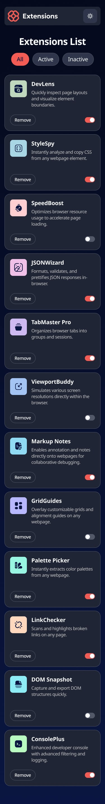
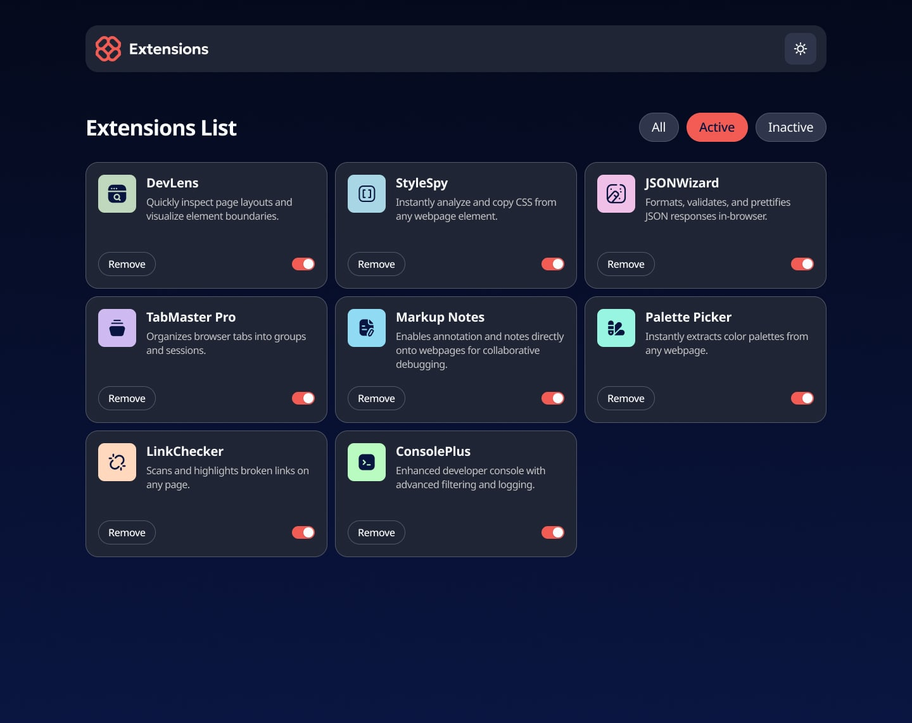

# Browser Extension Manager UI

## Live Demo

Check out the live demo: [Browser Extension Manager UI](https://13reath.github.io/Browser-extension-manager-UI/)


## Overview

The Browser Extension Manager UI is a responsive web application that provides a clean, intuitive interface for managing browser extensions. It allows users to view, search, and interact with their installed extensions through a modern, user-friendly design.

## Table of Contents

- [Features](#features)
- [Screenshots](#screenshots)
- [Technologies Used](#technologies-used)
- [Installation](#installation)
- [Usage](#usage)
- [Project Structure](#project-structure)
- [Development Process](#development-process)
- [Challenges and Solutions](#challenges-and-solutions)
- [Future Improvements](#future-improvements)
- [Contributing](#contributing)

## Features

- View all installed browser extensions
- Search and filter extensions
- Toggle extension activation status
- Responsive design for desktop and mobile devices
- Clean, minimalist user interface
- Interactive elements with hover and focus states
- Categorization of extensions
- Extension details and information display

## Screenshots

### Desktop View


### Mobile View


### Active States


## Technologies Used

- HTML5
- CSS3
- JavaScript
- Flexbox and Grid for layout
- Mobile-first responsive design
- CSS transitions for interactive elements

## Installation

1. Clone the repository:
   ```bash
   git clone https://github.com/13reath/Browser-extension-manager-UI.git
   ```

2. Navigate to the project directory:
   ```bash
   cd Browser-extension-manager-UI
   ```

3. Open the `index.html` file in your browser or use a live server extension if you're using VS Code.

## Usage

1. Browse through the list of extensions
2. Use the search bar to find specific extensions
3. Toggle extension activation using the toggle switches
4. View extension details by clicking on an extension
5. Filter extensions by category using the navigation menu

## Project Structure

```
Browser-extension-manager-UI/
├── public/                # Public assets
│   ├── design/            # Design files and screenshots
│   │   ├── active-states.jpg
│   │   ├── desktop-design.jpg
│   │   ├── desktop-preview.jpg
│   │   └── mobile-design.jpg
│   └── images/            # Image assets
│       ├── extension-icons/  # Extension icons
│       │   └── [various extension icons]
│       └── icons/         # UI icons
│           ├── icon-search.svg
│           ├── icon-toggle.svg
│           └── logo.svg
├── index.html             # Main HTML file
├── style.css              # CSS styles
├── script.js              # JavaScript functionality
└── README.md              # Project documentation
```

## Development Process

This project was developed following these steps:

1. Set up the basic HTML structure for the extension manager
2. Implemented the CSS styling with a mobile-first approach
3. Added responsive design for desktop views
4. Developed the search and filtering functionality with JavaScript
5. Implemented extension toggle switches and interactions
6. Added animations and transitions for interactive elements
7. Tested across different browsers and screen sizes
8. Optimized for performance and accessibility

## Challenges and Solutions

### Challenge 1: Extension List Performance
- **Problem**: Ensuring smooth performance when displaying and filtering potentially large lists of extensions
- **Solution**: Implemented efficient DOM manipulation and search algorithms to maintain responsiveness

### Challenge 2: Toggle Switch Design
- **Problem**: Creating visually appealing and accessible toggle switches
- **Solution**: Used custom CSS with proper ARIA attributes to ensure the toggles were both attractive and accessible

### Challenge 3: Responsive Layout
- **Problem**: Designing an interface that works well on both small mobile screens and large desktop displays
- **Solution**: Employed CSS Grid and Flexbox with carefully designed breakpoints to adapt the layout appropriately

## Future Improvements

- Add drag-and-drop functionality for reordering extensions
- Implement extension grouping feature
- Add detailed extension statistics and usage data
- Create extension conflict detection
- Implement extension update notifications
- Add support for extension settings management
- Implement dark/light theme toggle

## Contributing

Contributions are welcome! If you'd like to contribute to this project, please follow these steps:

1. Fork the repository
2. Create a new branch (`git checkout -b feature/amazing-feature`)
3. Make your changes
4. Commit your changes (`git commit -m 'Add some amazing feature'`)
5. Push to the branch (`git push origin feature/amazing-feature`)
6. Open a Pull Request
